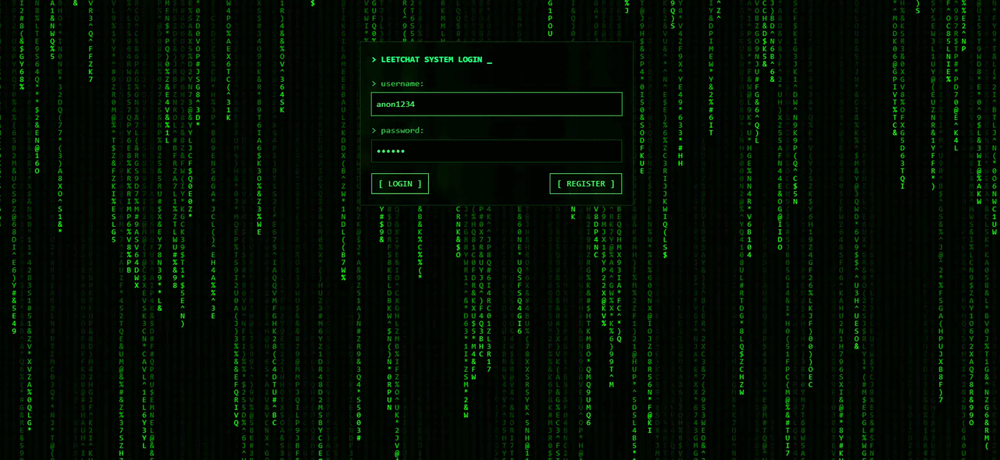

# LeetChat

  

A real-time chat application built with Blazor WebAssembly and ASP.NET Core. It provides user registration and login, JWT-based authentication, private conversations, and live messaging through SignalR.

## Features

- Blazor WebAssembly client
- ASP.NET Core .NET 9 backend
- User registration and login
- BCrypt password hashing
- JWT authentication
- Private conversations and message history
- Real-time messaging with SignalR
- PostgreSQL persistence through Entity Framework Core

## Technology stack

- .NET 9
- Blazor WebAssembly
- ASP.NET Core Web API
- SignalR
- Entity Framework Core
- PostgreSQL
- Npgsql
- BCrypt.Net

## Prerequisites

- .NET 9 SDK
- PostgreSQL
- Visual Studio 2022 or another .NET-compatible IDE

## Getting started

1. Clone the repository.
2. Create a PostgreSQL database.
3. Configure the connection string and JWT settings using .NET user secrets or environment variables. Do not commit credentials or signing keys.
4. Apply the Entity Framework Core migrations:
5. Start the application:
6. Open the HTTPS URL shown by the application, typically `https://localhost:7170`.

## Configuration

The example configuration is available in `BlazorChatApp/appsettingExample.md`. Replace its placeholder values through user secrets or environment-specific configuration. A JWT signing key should be long, random, and kept private.

For local development, configure .NET user secrets from the server project directory:

  

## Project structure

- `BlazorChatApp` — ASP.NET Core server, API, SignalR hub, authentication, and data access
- `BlazorChatApp.Client` — Blazor WebAssembly UI
- `BlazorChatApp.Shared` — DTOs and shared models
